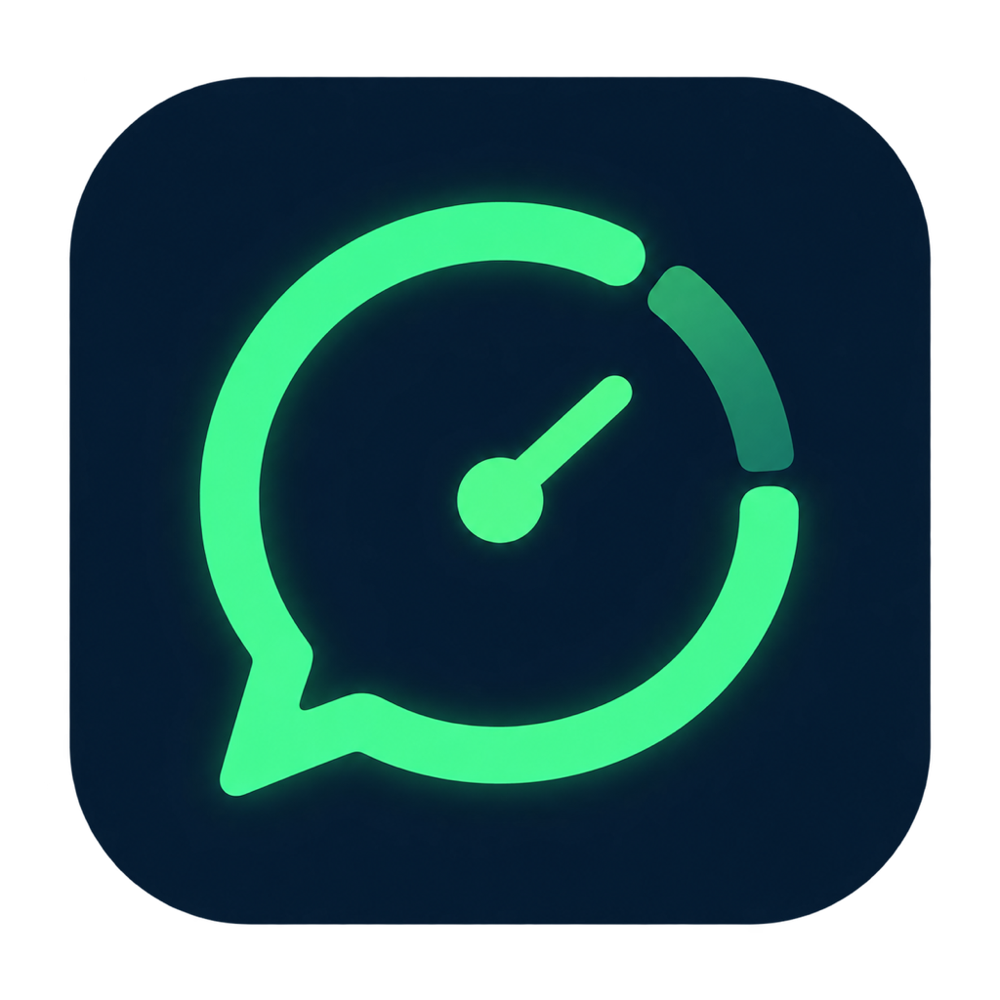
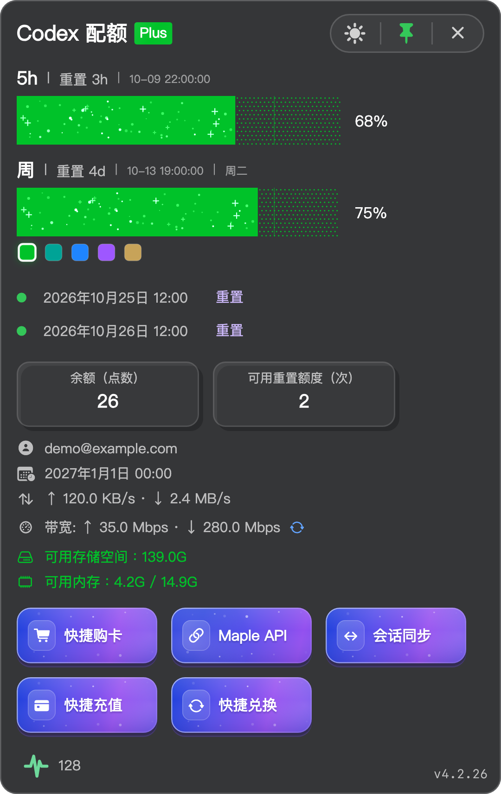

# 额度泡泡 · Quota Bubble

**额度泡泡（Quota Bubble）是独立开发的 Codex 配额查看工具，支持 macOS 和 Windows，可查看官方订阅账号的剩余额度与重置时间，并支持一键同步会话。**

[官网与下载](https://codex.maple.xin/) · [使用帮助](https://codex.maple.xin/help/) · [最新安装器](https://github.com/itzhaolei/quota-bubble/releases/latest) · [English](#english)

## 功能

- 查看账号提供的 5 小时与每周剩余额度、重置倒计时、套餐和账号信息。
- 一键同步会话，执行环境检查、会话迁移与重启；开始前请保存工作，同步会关闭并重新打开 Codex。
- 查看网速、估算带宽、存储和内存；从菜单栏或系统托盘查看配额百分比。
- 可用重置额度与手动重置操作按账号支持情况展示，不代表所有订阅都支持。

图中为真实组件的精简展示，账号、配额、资源读数和活跃客户端数量均为示例。五项快捷功能集中展示，实际可用项随当前配置变化。Plus 与两条重置记录仅说明这组演示数据，不代表所有 Plus 账号都拥有相同权益。

## 安装

1. 从[官网](https://codex.maple.xin/)下载适合当前系统的安装器，也可在[最新版本](https://github.com/itzhaolei/quota-bubble/releases/latest)中选择。
2. **macOS 13 及以上**（Apple 芯片或 Intel）：打开 DMG，将 `Quota Bubble.app` 拖入 `Applications（应用程序）`，然后启动。
3. **Windows 10 及以上**：运行 Setup 安装向导，完成后从桌面快捷方式启动。
4. 先在本机登录 Codex 官方订阅账号，再使用额度泡泡查看对应账号的数据。详细步骤见[使用帮助](https://codex.maple.xin/help/)。

额度泡泡为独立开发的工具，非 OpenAI 官方产品。本仓库提供官网文件与桌面安装器发行，应用源代码不在此公开。正式产品入口为上述官网与使用帮助。

## English

**额度泡泡 (Quota Bubble) is an independently developed Codex quota viewer for macOS and Windows. It shows remaining quota and reset times for official Codex subscription accounts and supports one-click session sync.**

[Website and downloads](https://codex.maple.xin/en/) · [User guide (Chinese)](https://codex.maple.xin/help/) · [Latest installers](https://github.com/itzhaolei/quota-bubble/releases/latest)

### Features

- View the 5-hour and weekly quota windows provided by your account, remaining percentages, reset countdowns, plan and account details.
- Run one-click session sync with environment checks, migration and restart. Save your work first: sync closes and reopens Codex.
- View network speed, estimated bandwidth, storage and memory, plus the quota percentage in the menu bar or system tray.
- Reset credits and manual reset actions appear only when supported by the account. They are not included with every subscription.

The preview above uses real app components in a simplified layout. The account, quota, resource readings and active-client count are demo data. All five shortcuts are shown together; their availability depends on the current configuration. The Plus label and two reset records describe this example; they do not promise the same benefits for every Plus account.

### Installation

1. Download the installer for your system from the [website](https://codex.maple.xin/en/) or [latest release](https://github.com/itzhaolei/quota-bubble/releases/latest).
2. **macOS 13 or later**, on Apple silicon or Intel: open the DMG, drag `Quota Bubble.app` into `Applications`, then launch it.
3. **Windows 10 or later**: run the Setup wizard, then launch the app from its desktop shortcut.
4. Sign in to your official Codex subscription account locally before checking its quota in Quota Bubble. See the [user guide (Chinese)](https://codex.maple.xin/help/) for details.

Quota Bubble is an independent tool, not an official OpenAI product. This repository distributes the website and desktop installers; it does not publish the application source code. Use the website and user guide above as the official product entry points.
